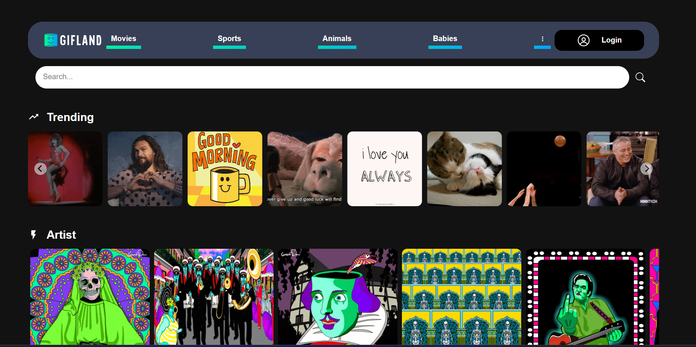
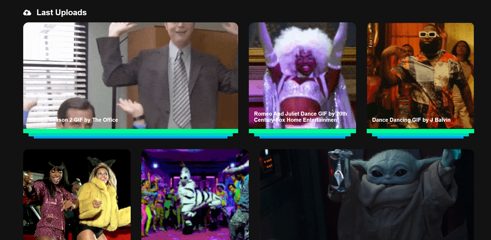
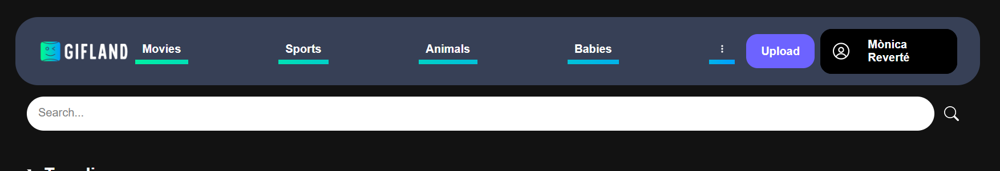
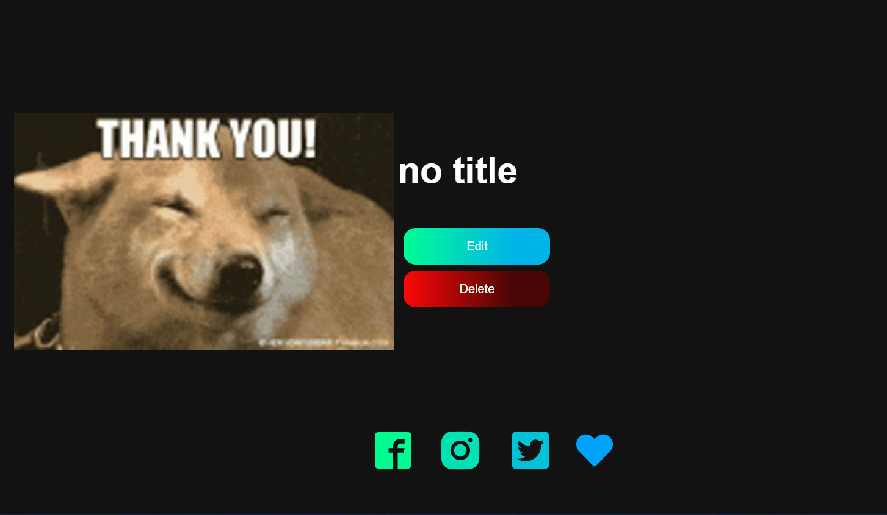
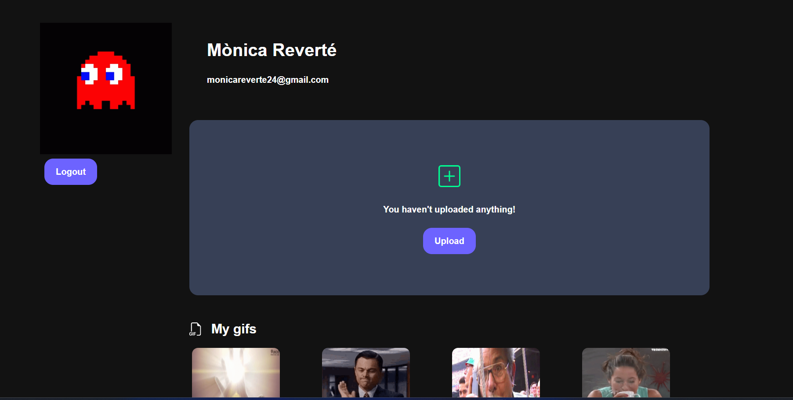

# GIFLAND

Gifland is a project made with Vite, stylized with CSS and with backend connection with MongoDB.

## Installation

In the project directory, you should run:

### `npm install`

### `npm run dev`

Runs the app in the development mode.

The page will reload when you make changes.\
You may also see any lint errors in the console.

## About the project

GifLand is made for AIT Student FullStack Challenge. This challence was doing during three days. The Goals of this project is to do it by less than three days and the objective was to be developed a Memes and Gifs web page in which users can upload their files and share it with everyone.

In this case, the priority was Frontend.

## 🎨 Requirements if you have prioritized <ins>frontend</ins>

- The **design** and **usability** of the website **will be valued**
- You will have to create and deliver the wireframes of what your application will be like.
- There will be no login or register pages
- All actions on the page will be performed on the same user, who will already be logged in by default.
- You will have to create your own **database** to **store** all the **information**

## 💯 Extra

- Use of **third-party API's**
- Use of **third-party libraries**
- The development of **additional features** to add more value to the **project** will be **valued positively**.
- Use an external service to deploy the **project**.

# Highlights of the project

- Login with auth0
- API call with axios
- Context Usage
- Routes
- Icons and Images
- Cloudinary
- Spinners and toast
- Filters
- Search

## Screenshots

# Home

# Header logged

# Edit and Delete

# Profile

